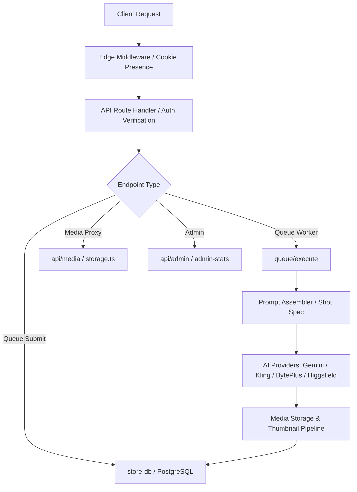

# Lumina Studio — Comprehensive Backend Architecture & Code Review Audit

> **Audit Date:** August 2026  
> **Scope:** Backend Architecture, API Routes, Database Layer, Auth & Session Model, Media Storage & Proxy, AI Providers, Middleware, Queue Execution Pipeline, and Utility Subsystems.

---

## 1. Executive Summary

This document presents a rigorous, full-scope backend code review and architectural audit of **Lumina Studio (VeeVee Studio)**. The backend is implemented as a serverless Next.js 15 (Node.js runtime) architecture utilizing PostgreSQL (via Drizzle ORM on Cloud SQL / Railway), cloud object storage (GCS / S3 with signed URL offloading and thumbnail derivation), and multi-provider AI generation integrations (Gemini Nano Banana Pro, BytePlus Seedance, Kling AI, Higgsfield MCP, and Vertex AI / Gemini Omni Flash).

### Key Audit Metrics
- **Total Backend Endpoints Audited:** 18 API routes
- **Core Library & Subsystem Modules Audited:** 26 backend modules
- **AI Provider Integrations Audited:** 7 providers
- **Critical & High Severity Bugs / Flaws:** 5
- **Medium / Low Severity Bugs:** 6
- **Security & Authorization (IDOR) Flaws:** 4
- **Stale / Dormant / Legacy Code Modules:** 6
- **Architectural Inconsistencies:** 5
- **Operational Inconveniences & Fragilities:** 4

---

## 2. Critical & High Severity Issues

### 🚨 BUG-01: False Generation Failures Caused by Video Status Polling Error Swallowing
- **Location:** [`src/app/api/generate/video/status/route.ts:198-204`](file:///Users/ais4/Desktop/Rohit%20Chavda/Dev/image-video-project/src/app/api/generate/video/status/route.ts#L198-L204)
- **Severity:** High (User-Facing / Reliability)
- **Description:**  
  When polling BytePlus or Higgsfield MCP for video completion, any transient network blip (e.g. 502/503 bad gateway, network timeout, momentary MCP socket disconnect) is caught in the `catch` block. The endpoint responds with:
  ```ts
  return NextResponse.json({ ...item, status: "failed", error: `Poll Error: ${e?.message || String(e)}` });
  ```
  While the database row remains `status: "running"`, the frontend client receives a response with `status: "failed"` and HTTP 200. The frontend's Zustand store immediately marks the job as failed and permanently stops polling. If the remote provider completes the render minutes later, the user never sees it because polling was prematurely terminated.
- **Remediation:**  
  Transient poll errors must return HTTP 500 (or `{ status: "running", transientError: ... }`), so the client exponential backoff can continue polling rather than aborting.

---

### 🚨 SEC-01: Insecure Direct Object Reference (IDOR) on History Deletion, Favoriting & Organization
- **Location:** [`src/app/api/history/route.ts:38-80`](file:///Users/ais4/Desktop/Rohit%20Chavda/Dev/image-video-project/src/app/api/history/route.ts#L38-L80)
- **Severity:** High (Security / Authorization)
- **Description:**  
  In `PATCH /api/history` and `DELETE /api/history`, any authenticated user can mutate (favorite, move folders) or permanently delete *any* generation across the entire database simply by passing its UUID in `?id=...`. Neither endpoint verifies that `item.userId === user.id` (or `user.role === "admin"`).
- **Remediation:**  
  Enforce tenant/ownership checks prior to mutations:
  ```ts
  const item = await getItem(id);
  if (!item) return NextResponse.json({ error: "Not found" }, { status: 404 });
  if (item.userId !== user.id && user.role !== "admin") {
    return NextResponse.json({ error: "FORBIDDEN" }, { status: 403 });
  }
  ```

---

### 🚨 SEC-02: Unauthorized Queue Execution Trigger (IDOR on Worker Dispatch)
- **Location:** [`src/app/api/queue/execute/route.ts:270-286`](file:///Users/ais4/Desktop/Rohit%20Chavda/Dev/image-video-project/src/app/api/queue/execute/route.ts#L270-L286)
- **Severity:** High (Security / Abuse)
- **Description:**  
  `POST /api/queue/execute` takes `{ id }` in the body and verifies that the caller has an active session (`const user = await getSession()`), but never checks whether the caller owns the generation `id`. Any authenticated user can trigger execution, manipulate state, or drain provider credits on other users' queued jobs.
- **Remediation:**  
  Verify `base.userId === user.id` (or admin) immediately after fetching `base = await getItem(id)`.

---

### 🚨 SEC-03: Canvas Boards Mutation & Board State Tampering without Ownership Verification
- **Location:** [`src/app/api/canvas-boards/route.ts:47-64`](file:///Users/ais4/Desktop/Rohit%20Chavda/Dev/image-video-project/src/app/api/canvas-boards/route.ts#L47-L64), [`src/app/api/canvas-boards/[id]/route.ts:25-57`](file:///Users/ais4/Desktop/Rohit%20Chavda/Dev/image-video-project/src/app/api/canvas-boards/%5Bid%5D/route.ts#L25-L57)
- **Severity:** Medium-High (Security)
- **Description:**  
  - `POST /api/canvas-boards` handles `renameBoard` and `deleteBoard` with no check that the board belongs to the current user or that the user has write access to the associated project.
  - `PUT /api/canvas-boards/[id]` accepts arbitrary state modifications without ownership verification.
  - `POST /api/canvas-boards/[id]/upload` ignores the `[id]` parameter entirely and accepts arbitrary uploads into the media backend.
- **Remediation:**  
  Check `board.userId === user.id` (or project permission) before allowing renames, deletes, and state updates. Validate `id` exists on `/upload`.

---

### 🚨 SEC-04: Non-Constant-Time Signature Comparison in Session Auth
- **Location:** [`src/lib/auth.ts:40-48`](file:///Users/ais4/Desktop/Rohit%20Chavda/Dev/image-video-project/src/lib/auth.ts#L40-L48)
- **Severity:** Medium (Security Best Practice)
- **Description:**  
  `verifySession` splits the cookie into `payload` and `sig`, calculates HMAC-SHA256 `expectedSig = sign(payload)`, and compares them using JavaScript standard equality `expectedSig === sig`. Standard string comparison terminates on the first mismatching character, creating theoretical timing side-channel leakage.
- **Remediation:**  
  Use `crypto.timingSafeEqual`:
  ```ts
  const a = Buffer.from(sig, "hex");
  const b = Buffer.from(expectedSig, "hex");
  if (a.length !== b.length || !crypto.timingSafeEqual(a, b)) return null;
  ```

---

## 3. Logic Bugs & Edge Case Failures

### 🐛 BUG-02: CSV Export Formatting Broken by Truncation Comment
- **Location:** [`src/app/api/admin/logs/route.ts:73-75`](file:///Users/ais4/Desktop/Rohit%20Chavda/Dev/image-video-project/src/app/api/admin/logs/route.ts#L73-L75)
- **Severity:** Low-Medium
- **Description:**  
  When exported logs reach `MAX_CSV_ROWS` (10,000), the route appends `# truncated at 10000 rows...` to the CSV output. Standard RFC 4180 CSV parsers (including Excel, Python `pandas`, Sheets) throw parsing errors when an unquoted comment line with differing column count is encountered at the end of the file.
- **Remediation:**  
  Send truncation info in an HTTP header (e.g. `X-Logs-Truncated: true`) rather than breaking CSV structure.

---

### 🐛 BUG-03: Media Extension Detection Failure on Extensionless URLs in ZIP Download
- **Location:** [`src/app/api/history/download-zip/route.ts:9-19`](file:///Users/ais4/Desktop/Rohit%20Chavda/Dev/image-video-project/src/app/api/history/download-zip/route.ts#L9-L19), [`src/app/api/history/download-zip/route.ts:55`](file:///Users/ais4/Desktop/Rohit%20Chavda/Dev/image-video-project/src/app/api/history/download-zip/route.ts#L55)
- **Severity:** Low
- **Description:**  
  `extensionFromContentType(null, item.url)` is called with `null` hardcoded as the first parameter. The fallback logic splits the URL by `.`, but if a media item key has no extension or is stored as a UUID, it defaults to `.bin`. Since `readStoredBuffer(key)` has already read the raw image bytes, checking the first bytes (magic numbers for PNG `89 50 4E 47`, JPEG `FF D8 FF`, WebP `52 49 46 46`) would accurately resolve the file extension.

---

### 🐛 BUG-04: Memory Pressure During Parallel Best-of-N Candidate Generation
- **Location:** [`src/app/api/queue/execute/route.ts:465-520`](file:///Users/ais4/Desktop/Rohit%20Chavda/Dev/image-video-project/src/app/api/queue/execute/route.ts#L465-L520)
- **Severity:** Medium (Scalability / Stability)
- **Description:**  
  When `FACE_BEST_OF=4` is configured with 4K resolution renders, 4 large base64 strings (each up to 10–25 MB uncompressed in Node.js V8 memory) are held simultaneously in memory during forensic judging (`judgeCandidate` / `judgeIdentity`). Under Fluid Compute concurrency where multiple queue executions share a container, this can exceed serverless memory limits (e.g. 1024MB) and cause silent OOM container kills.
- **Remediation:**  
  Stream/buffer candidate images to disk or temporary storage during evaluation rather than retaining 4 full-resolution raw base64 strings in V8 memory.

---

## 4. Stale, Dormant & Dead Code

| File / Component | Status | Issue & Recommendation |
| :--- | :--- | :--- |
| [`src/lib/providers/vertex-imagen.ts`](file:///Users/ais4/Desktop/Rohit%20Chavda/Dev/image-video-project/src/lib/providers/vertex-imagen.ts) | **Dormant / Deprecated** | `imagen-3.0-capability-001` is marked dormant due to facial identity degradation and 1K-only caps. It is superseded by `gemini.ts` (Nano Banana Pro) and `kling.ts`. Either formalize its deprecation or remove it to reduce attack surface. |
| [`scripts/migrate-to-blob.ts`](file:///Users/ais4/Desktop/Rohit%20Chavda/Dev/image-video-project/scripts/migrate-to-blob.ts) | **Stale Migration** | One-off migration script for Vercel Blob (which was deprecated in favor of S3/GCS). Safe to archive in `.archive/` or delete. |
| [`scripts/migrate-to-s3.ts`](file:///Users/ais4/Desktop/Rohit%20Chavda/Dev/image-video-project/scripts/migrate-to-s3.ts) | **Stale Migration** | One-off migration script for legacy S3 bucket migration. |
| [`scripts/migrate-postgres-to-cloud-sql.ts`](file:///Users/ais4/Desktop/Rohit%20Chavda/Dev/image-video-project/scripts/migrate-postgres-to-cloud-sql.ts) | **Stale Migration** | Completed migration script from Railway to Google Cloud SQL. |
| [`src/lib/status-checks.ts:36`](file:///Users/ais4/Desktop/Rohit%20Chavda/Dev/image-video-project/src/lib/status-checks.ts#L36) | **Comment Drift** | Docstring states *"checks is always length 6"*, but the module was expanded to 8 checks (including `media-delivery` and `kling`). |
| [`src/lib/pricing.ts`](file:///Users/ais4/Desktop/Rohit%20Chavda/Dev/image-video-project/src/lib/pricing.ts) | **Hardcoded Fallbacks** | Hardcoded pricing fallback table can silently diverge from the DB `pricing` table if new models are added in database without updating TypeScript constants. |

---

## 5. Architectural & Design Inconsistencies

### 1. Inconsistent Billing & Cost Accounting Across Providers
- **Kling AI:** Reports post-generation actual billing via `unitDeduction`. `queue/execute/route.ts` converts this with `klingUnitsToCents()` and updates `costCents` on the record.
- **Gemini / Nano Banana Pro / BytePlus / Higgsfield:** `costCents` is fixed at enqueue-time from static estimates in the pricing table, ignoring real input token count, duration scaling, or best-of-N candidate count when `bestOf` dynamically adjusts.
- **Impact:** Admin analytics show exact charges for Kling but approximate estimates for Google and BytePlus.

### 2. Inconsistent Error & Status Responses Across API Routes
- Some endpoints return standard error objects: `{ error: "UNAUTHENTICATED" }` with HTTP 401.
- Some endpoints return human sentences: `{ error: "Job ID is required." }` or `{ error: "Missing id." }` with HTTP 400.
- Some return Boolean flags: `{ ok: true }`.
- Some return updated entity objects.
- **Impact:** Frontend API client has to handle polymorphic response shapes instead of a unified envelope format (e.g. `{ data, error, success }`).

### 3. Aspect Ratio Storage & Enforcement Inconsistency
- **Kling AI:** Explicitly measures the generated image via `sharp` and overwrites `aspectRatioOut` with the measured aspect ratio because Kling ignores requested ratios for image-to-image.
- **Gemini & BytePlus:** Assumes the provider strictly adhered to requested aspect ratio and stores the requested value without measurement verification.

### 4. Edge Middleware vs Route Handler Auth Discrepancy
- `src/middleware.ts` runs on the Vercel Edge runtime and only checks for cookie presence: `!!req.cookies.get("veevee_session")?.value`.
- Real cryptographic verification only happens if the route handler calls `getSession()`, `requireUser()`, or `adminOrNull()`.
- If an engineer adds a new API route and forgets to call `getSession()`, the endpoint appears protected on edge but is completely open to any client sending a dummy cookie.

---

## 6. Operational Inconveniences & Developer Friction

### 1. Single-Use Higgsfield MCP OAuth Refresh Token Fragility
- **Issue:** Higgsfield's MCP server uses strict single-use OAuth refresh tokens. If two concurrent backend serverless instances attempt to refresh the token at the same second, one refresh succeeds and the other fails, causing Higgsfield's OAuth server to invalidate the entire token family.
- **Friction:** When revoked, generation fails for all users until an admin manually runs `npm run hf:login` locally and POSTs credentials via `/api/admin/set-token`.
- **Solution:** Implement a distributed lock in PostgreSQL (`SELECT pg_advisory_xact_lock(...)`) during token refresh so only one instance can exchange refresh tokens at a time.

### 2. Dual-Cloud Storage Logic Overhead in `storage.ts`
- **Issue:** `src/lib/storage.ts` contains >800 lines of complex dual-branching code for Google Cloud Storage (GCS) and AWS S3, including separate IAM signing, presigning, credentials parsing, and streaming proxy routines.
- **Friction:** Every change to media handling requires writing and testing dual pathways for both S3 and GCS backends.
- **Recommendation:** Refactor into an abstract `StorageProvider` interface with discrete `GcsStorageProvider` and `S3StorageProvider` class implementations.

### 3. Serverless Process Termination & Stale "Running" State
- **Issue:** If an image generation times out at 300s, Vercel Fluid Compute hard-kills the Node.js process. The route's `catch` block never executes, leaving the row stranded as `running`.
- **Friction:** The slot is blocked until `reapStaleRunningImages()` sweeps it (7 minutes later).
- **Recommendation:** Reduce worker timeout to 280s with an internal `AbortController` timeout at 270s so the application-level `catch` block always executes gracefully before platform termination.

---

## 7. Subsystem-by-Subsystem Audit Summary



### Module Audit Matrix

| File / Subsystem | Lines | Primary Responsibility | Audit Status | Key Finding |
| :--- | :--- | :--- | :--- | :--- |
| `src/lib/auth.ts` | 135 | Stateless HMAC session tokens | ⚠️ Needs Patch | Needs `timingSafeEqual` for signature verification. |
| `src/lib/db.ts` | 196 | Postgres connection pool & recycle | ✅ Healthy | Age-based 30m pool recycling works well for Cloud SQL. |
| `src/lib/storage.ts` | 830 | GCS / S3 storage & signing | ⚠️ Inconvenience | Dual-backend code is monolithic; should be split into adapter classes. |
| `src/lib/store-db.ts` | 629 | Generation state, queue & reaper | ✅ Healthy | Atomic locking via Drizzle `where status = 'queued'` is solid. |
| `src/lib/spend-window.ts` | 152 | Gemini spend rate-limit admission | ✅ Healthy | Accurately prevents 429 bursts on 10m rolling window. |
| `src/lib/save-media.ts` | 128 | Base64/URL to storage persistence | ✅ Healthy | Solid cleanup on format conversion & thumbnail triggers. |
| `src/lib/prompt-assembler.ts` | 496 | Context engineering & asset binding | ✅ Healthy | Robust asset and role grouping logic. |
| `src/lib/shot-spec.ts` | 450 | Shot framing & negative codas | ✅ Healthy | Clean regex detection for camera moves and styles. |
| `src/lib/video-directive.ts` | 267 | Unified video prompt scaffolding | ✅ Healthy | Precedence rules and style neutrality well-reasoned. |
| `src/lib/middleware/face-judge.ts` | 189 | Forensic face identity scoring | ✅ Healthy | Robust candidate selection and fail-open design. |
| `src/lib/middleware/image-prep.ts` | 410 | Image resizing, tiling & face crop | ⚠️ High Memory | Keep eye on multi-candidate memory during 4K crops. |
| `src/lib/providers/gemini.ts` | 338 | Google Gemini / Nano Banana Pro | ✅ Healthy | Exponential backoff and high-res size calculation are robust. |
| `src/lib/providers/seedance.ts` | 352 | BytePlus ModelArk Seedance 2.0/2.5 | ✅ Healthy | Task creation and video reference signing are correct. |
| `src/lib/providers/kling.ts` | 312 | Kling AI generation & unit cost | ✅ Healthy | Aspect ratio auto-detection from response is accurate. |
| `src/lib/providers/higgsfield-mcp.ts` | 340 | Higgsfield MCP OAuth & task API | ⚠️ Fragile | Single-use refresh token needs concurrency lock. |
| `src/lib/providers/omni.ts` | 148 | Gemini Omni Flash Video | ✅ Healthy | Clean interaction part formatting. |

---

## 8. Prioritized Action Plan

### Phase 1: Critical Bug & Security Fixes (Immediate)
1. **Fix Video Status Error Handling:** In [`src/app/api/generate/video/status/route.ts`](file:///Users/ais4/Desktop/Rohit%20Chavda/Dev/image-video-project/src/app/api/generate/video/status/route.ts), do not return `status: "failed"` on transient fetch/poll errors. Return HTTP 500 so client poller continues.
2. **Patch IDOR Vulnerabilities:** Add `userId` ownership checks in `DELETE /api/history`, `PATCH /api/history`, `POST /api/queue/execute`, and `POST /api/canvas-boards`.
3. **Enhance Auth Timing Safety:** Use `crypto.timingSafeEqual` in `src/lib/auth.ts`.

### Phase 2: Code Quality & Stale Code Cleanup
1. **Archive/Remove One-Off Migration Scripts:** Clean up `scripts/migrate-to-blob.ts`, `scripts/migrate-to-s3.ts`, and `scripts/migrate-postgres-to-cloud-sql.ts`.
2. **Fix CSV Export Formatting:** Remove `# truncated at...` line from `src/app/api/admin/logs/route.ts` output.
3. **Fix Status Checks Documentation:** Align comment in `src/lib/status-checks.ts` with the 8 active checks.

### Phase 3: Architecture & Operational Hardening
1. **Higgsfield Refresh Concurrency Lock:** Wrap OAuth token refresh in a PostgreSQL transaction lock.
2. **Storage Adapter Decomposition:** Decompose `src/lib/storage.ts` into discrete `GcsStorageProvider` and `S3StorageProvider` implementations.
3. **Controlled Timeout Abort:** Add an internal 270s `AbortController` in `src/app/api/queue/execute/route.ts` to ensure database state is updated before platform execution timeout.
